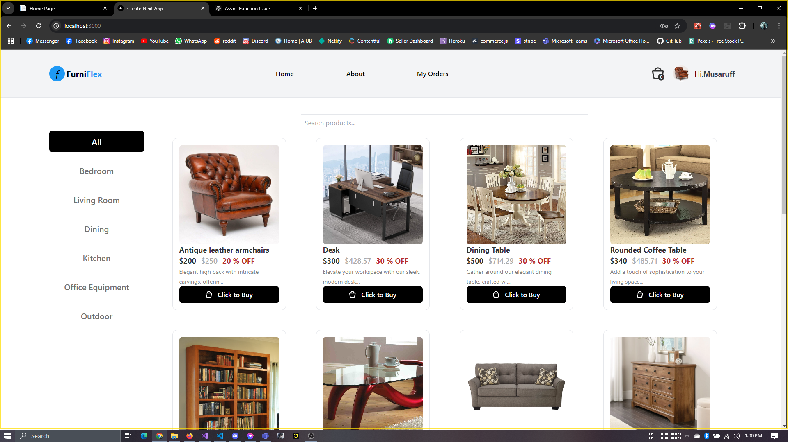

### FurniFlex Frontend (Next.js 14)

````markdown
# FurniFlex Frontend

This is the frontend for FurniFlex, an e-commerce platform for browsing, ordering, and managing furniture purchases. The frontend is built using Next.js 14 with React and communicates with the FurniFlex backend through REST API.

## Features

-   **Furniture Browsing**: Users can browse and search furniture items.
-   **Shopping Cart**: Users can add items to their cart and proceed to checkout.
-   **Order Placement & Tracking**: Users can place orders, track their order status, and leave reviews on purchased products.
-   **Admin Dashboard**: Admins can view sales and user summaries in charts, manage products, and orders.

## Demo



### Watch the full demo:

[](./FurniFlex_Demo.mp4)

## Setup Instructions

1. Clone the repository:
2. Install the dependencies
    ```
    npm install
    ```
3. Start the dev server

    ```
    npm run dev
    ```

4. Access the application at http://localhost:3000.

## Technologies Used

-   Next.js 14
-   React
-   Tailwind CSS
-   TypeScript
-   REST API Integration with the ASP.NET Web API backend
````
